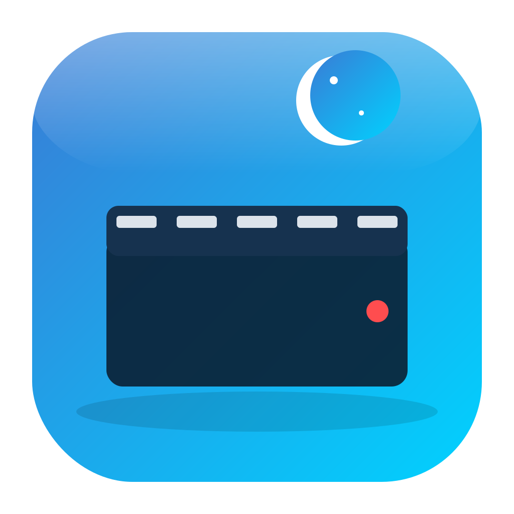

# GIF Land - Screen Recorder

  

  
  
  

  <h3>🎬 Powerful screen recording tool for GIF, WebP, and MP4</h3>
  
Record your screen with high quality and small file sizes

---

## ✨ Features

- 🎯 **Multiple Recording Modes** - Full screen, area selection, or window capture
- 📹 **Multiple Formats** - Export as GIF, WebP, or MP4
- 🚀 **High Performance** - Optimized encoding for smooth recordings
- 🎨 **Customizable Quality** - Adjust FPS, quality, and scale to your needs
- ⏸️ **Pause & Resume** - Control your recording without losing frames
- 💾 **Small File Sizes** - WebP format provides excellent quality with minimal size

## 📥 Download

Choose the version for your operating system:

### 🍎 macOS

| Platform | Download | Requirements |
|----------|----------|--------------|
| **Mac (Apple Silicon)** | [Download DMG](https://github.com/ozgurdemirel/GIF-Land/releases/latest/download/GIF-Land-macOS-arm64.dmg) | M1/M2/M3/M4 Macs |
| **Mac (Intel)** | [Download DMG](https://github.com/ozgurdemirel/GIF-Land/releases/latest/download/GIF-Land-macOS-x64.dmg) | Intel-based Macs |

### 🪟 Windows

| Platform | Download | Requirements |
|----------|----------|--------------|
| **Windows** | [Download MSI](https://github.com/ozgurdemirel/GIF-Land/releases/latest/download/GIF-Land-windows.msi) | Windows 10/11 (64-bit) |

## 🚀 Quick Start Guide

### macOS Installation

1. **Download** the DMG file for your Mac type (Apple Silicon or Intel)
2. **Open** the downloaded DMG file
3. **Drag** GIF Land to your Applications folder
4. **Launch** GIF Land from Applications
5. **Allow** screen recording permission when prompted:
   - Go to **System Preferences** → **Security & Privacy** → **Privacy** → **Screen Recording**
   - Check the box next to **GIF Land**

> **Note:** On first launch, you may see "GIF Land can't be opened because it is from an unidentified developer". Right-click the app and select "Open" to bypass this warning.

### Windows Installation

1. **Download** the MSI installer
2. **Run** the installer and follow the setup wizard
3. **Launch** GIF Land from Start Menu or Desktop shortcut
4. **Allow** any Windows security prompts for screen capture

## 📖 How to Use

### 1️⃣ Select Recording Mode

Choose how you want to capture your screen:

- **🖥️ Full Screen** - Records your entire display
- **📐 Area Selection** - Draw a rectangle to define recording area
- **🪟 Window Capture** - Select a specific application window

### 2️⃣ Configure Settings

Customize your recording:

| Setting | Description | Recommended |
|---------|-------------|-------------|
| **Format** | Output file format | WebP for web, MP4 for video, GIF for compatibility |
| **FPS** | Frames per second (1-60) | 15-30 for most uses |
| **Quality** | Encoding quality (1-100) | 80-90 for balanced quality/size |
| **Scale** | Resize factor (0.1-1.0) | 1.0 for full quality |

### 3️⃣ Start Recording

1. Click the **red record button** to begin
2. Perform your screen actions
3. Use **pause/resume** if needed
4. Click **stop** when finished

### 4️⃣ Save Your Recording

- Recordings are automatically saved to your **Documents** folder
- Files are named with timestamp: `recording_2025-10-05_14-30-45.webp`
- You can change the save location in settings

## 💡 Tips & Best Practices

### For Small File Sizes
- Use **WebP** format (up to 80% smaller than GIF)
- Set FPS to **15** for most demonstrations
- Use **0.5-0.75** scale for large recordings

### For High Quality
- Use **MP4** format with quality **80-100**
- Set FPS to **30** or higher
- Keep scale at **1.0**

### For Web Sharing
- **WebP** provides best quality/size ratio
- **GIF** for maximum compatibility
- Consider reducing scale for faster loading

## ⚡ Keyboard Shortcuts

| Action | macOS | Windows |
|--------|-------|---------|
| Start/Stop Recording | `⌘ + R` | `Ctrl + R` |
| Pause/Resume | `⌘ + P` | `Ctrl + P` |
| Cancel Recording | `Esc` | `Esc` |
| Area Selection | `⌘ + A` | `Ctrl + A` |

## 🔧 Troubleshooting

### macOS Issues

**"App can't be opened because it is from an unidentified developer"**
- Right-click the app → Select "Open" → Click "Open" in the dialog

**Screen recording permission denied**
- System Preferences → Security & Privacy → Privacy → Screen Recording
- Enable GIF Land

**App crashes on launch (Apple Silicon)**
- Make sure you downloaded the ARM64 version
- Try Intel version with Rosetta 2 if issues persist

### Windows Issues

**"Windows protected your PC" warning**
- Click "More info" → "Run anyway"

**Black screen in recordings**
- Run as Administrator
- Disable Hardware Acceleration in apps being recorded

**High CPU usage**
- Lower FPS to 15-20
- Reduce recording area size
- Use WebP format instead of GIF

## 🛠️ For Developers

Want to contribute or build from source? Check out our [Developer Documentation](docs/developers.md).

## 🆘 Support

Need help? Have questions?

- 📝 [Report Issues](https://github.com/ozgurdemirel/GIF-Land/issues)
- 💬 [Discussions](https://github.com/ozgurdemirel/GIF-Land/discussions)
- 📧 Email: support@gifland.app

## 📄 License

This project is licensed under the Apache License 2.0 - see the [LICENSE](LICENSE) file for details.

## 🌟 Show Your Support

If you find GIF Land useful, please consider:
- ⭐ Starring the project on [GitHub](https://github.com/ozgurdemirel/GIF-Land)
- 🐛 Reporting bugs and suggesting features
- 🤝 Contributing to the codebase

## AI Usage Transparency

**AI-Assisted**:
- Project structure and boilerplate
- Resilience4j configuration patterns
- Documentation formatting
- Edge case test generation

**Human Expertise**:
- Core algorithm design (round-robin, adaptive retry)
- Performance optimization and profiling
- Lazy stream synchronization debugging
- Production readiness assessment

---

  Made with ❤️ by <a href="https://github.com/ozgurdemirel">Özgür Demirel</a>
   
  Built with Kotlin/Compose Desktop

